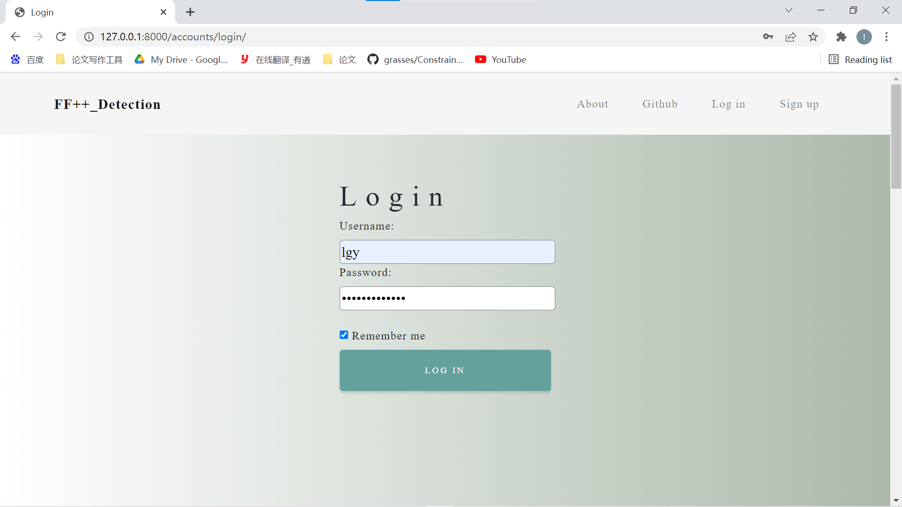
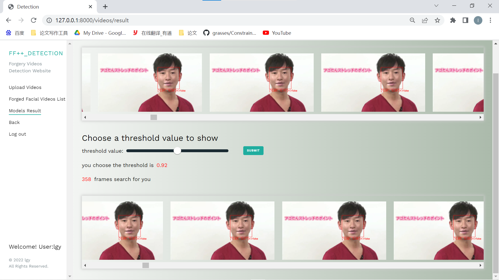

# report

> ##### 廖桂樱 https://github.com/mudouble/DeepFakes-Detection-Website.gitite.git

## 一、环境说明

- python==3.9.7 

- django==2.2.4

## 二、部署方式

- ### Anaconda 配置环境

- ### 依赖库

  - pytorch==1.10.0
  - dlib==19.22.0
  - opencv-python==4.5.5.62
  - Pillow==8.4.0
  - matplotlib==3.5.1
  - numpy==1.21.2
  - opencv-python==4.1.1.26
  - pandas==1.4.1
  - requests==2.26.0
  - torch==1.2.0+cpu
  - torchvision==0.11.1+cpu
  - tqdm==4.62.3
  - django-silk==4.3.0

- ### 其他的外部函数库（下载）
- openh264-1.8.0-win64.dll 视频编码格式H.264的函数库 Github搜索OpenCV H.264 需要放在项目执行文件夹内

- ### 安装项目依赖

- ### 运行方式

  在项目根目录下打开控制台，输入以下命令：

  ```bash
  python3 manage.py makemigrations
  python3 manage.py runserver
  python3 manage.py migrate
  ```

  然后打开浏览器终端，访问 https://127.0.0.1:8000 即可自动跳转至项目主页
  

## 三、网页界面

- ### 项目主页

  

  - 左上角为项目名称：FF++_Detection。点击可跳转至主页。
  - 中心部分文字为项目logo及简介：FaceForensics++ 伪造人脸视频检测网站。
  - 中心部分按钮为开始导航按钮，点击可跳转至视频展示页面。
  - 右上角左起第一个按钮为主页的导航按钮，点击可跳转至主页响应部分。
  - 右上角左起第二个按钮点击可以跳转到项目的GitHub网页
  - 右上角右起两个按钮分别为注册、登录按钮，点击可跳转至响应页面。

- ### 登录页面

  

  - 中心部分从上至下两个输入框分别为用户名、密码输入框。
  - 中心部分按钮为登录按钮，若用户名、密码正确，点击即可跳转至用户历史图片展示页面。
  - 其余部分同上。

- ### 注册页面

  

  - 中心部分从上至下三个输入框分别为用户名、密码、确认密码输入框。
  - 中心部分按钮为注册按钮，若用户名未被使用且密码合法，点击即可跳转至项目主页。
  - 其余部分同上。

- ### 上传本地图片页面

  

  - 中心部分从上至下两个输入框分别为视频标题输入框、视频文件选择框。
  - 中心部分按钮为上传按钮，若上传成功则跳转至视频展示页面。
  - 其余部分同上。

- ### 视频列表展示页面

  

  - 左上角logo为项目主页导航按钮，点击即可跳转至项目主页，下面文字为项目介绍。
  - logo下方从上至下依次为：
    - 本页导航链接，点击可刷新（回到）本页。
    - 上传本地图片链接，点击即可跳转至本地图片上传页面。
    - 视频列表链接，即当前页面
    - 注销按钮，点击即可注销当前用户并跳转至项目主页。
  - 下方为欢迎文字，User代表当前登录的为普通用户，lgy代表用户名。
  - 右方展示了数据库里存放相关伪造和真实人脸视频，每个视频上方是视频的名字
  - 右方的下方为翻页按钮及显示当前页面索引的提示文字。

- ### 视频详情页面

  

  - 左边从上至下的链接依次为：

    - 视频详情链接，可刷新（回到）此页面。
    - 视频列表展示链接，点击可以跳转到视频列表界面。
    - 模型检测链接，即当前界面
    - 返回按钮，点击回到上一页
    - 注销按钮，点击注销账号回到主界面

  - 右边从上之下依次为：
    - 视频标题
    - 视频播放界面
    - 提示用户猜测视频真假文字
    - 滑动条，显示百分比
    - 选择模型跳转按钮，点击跳转模型检测界面

- ### 模型检测检测界面
 
  
  
  - 左边从上至下的链接依次为：
    - 视频列表展示链接，点击可以跳转到视频列表界面。
    - 模型检测链接，即当前界面
    - 返回按钮，点击回到上一页
    - 注销按钮，点击注销账号回到主界面

  - 右边从上之下依次为：
    - 视频标题
    - 视频播放界面
    - 三个模型选择按钮，点击按钮启动模型检测程序，下方出现提示语句，检测完成页面自动跳转到检测结果界面

- ###  检测结果界面
 
  

  - 左边从上至下的链接依次为：
    - 视频列表展示链接，点击可以跳转到视频列表界面。
    - 模型结果界面，点击可以跳转到阈值筛选界面
    - 返回按钮，点击回到上一页
    - 注销按钮，点击注销账号回到主界面

  - 右边从上之下依次为：
    - 提示语句，表示模型检测完成
    - 第一个滑动窗口显示视频帧提取
    - 第二个滑动窗口显示人脸定位裁剪
    - 模型检测结果视频播放界面
    - 视频使用的伪造方法和压缩格式

- ###  阈值提取界面
 
  

  - 左边从上至下的链接依次为：
    - 上传本地视频链接
    - 视频列表展示链接
    - 当前页面链接
    - 返回按钮，点击回到上一页
    - 注销按钮，点击注销账号回到主界面

  - 右边从上之下依次为：
    - 所有检测帧在滑动窗口展示
    - 滑动条选择任意一个阈值，旁边有一个提交按钮，点击后可以获得阈值过滤后的检测帧
    - 第二个滑动窗口显示阈值过滤后的检测帧
    
## 四、几点说明

- 用户上传的文件的相对存储地址为./media/in_out_videos/manipulate。
- 模型检测的视频帧和人脸图片的相对存储路径为：./preprocess_images。
- 模型检测后合成的结果视频的相对存储路径为：./media/in_out_videos/result
- 对时长比较久的视频进行模型检测耗时较长（cpu至少2分钟），期间请耐心等待网页返回结果。

- 已经训练好的深度学习模型存放在faceforensics++_models

## 五、参考GitHub、网站

- https://detectfakes.media.mit.edu/#
- https://github.com/iltyty/PictureSite


